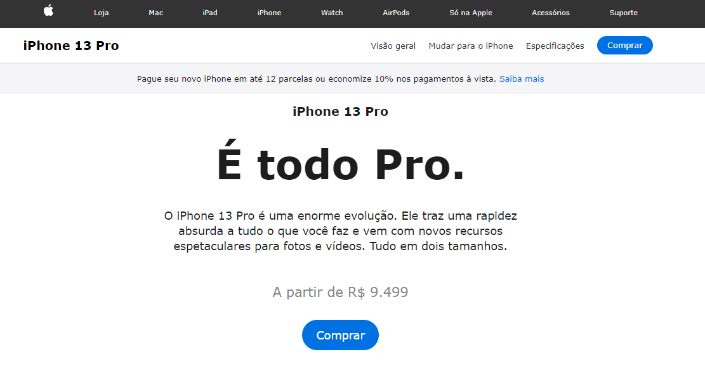
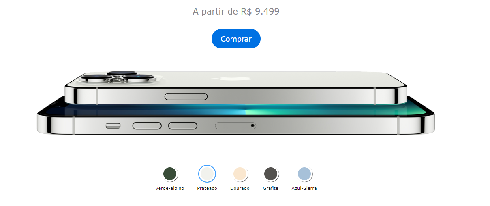

# Site da Apple - iPhone 13.

> Projeto clone da página inicial do site da apple desenvolvido com JavaScript, HTML e CSS.

Esse projeto é um clone da página do site da apple onde é vendido o iPhone 13.

Tela inicial:

Funcionalidade que permite escolher a cor do iPhone 13:

## Tecnologias
- JavaScript
- HTML
- CSS
- Git e GitHub